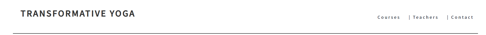
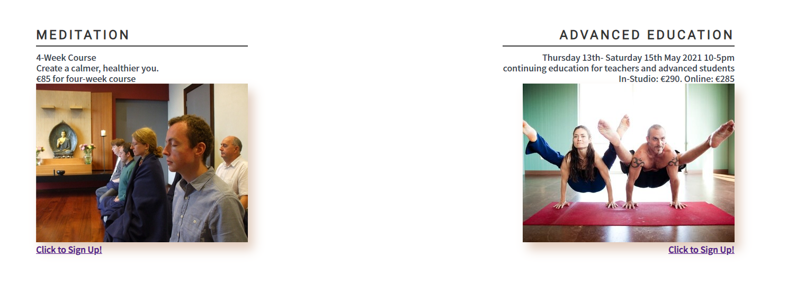
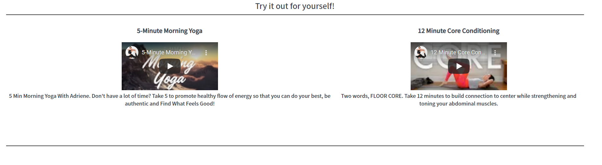
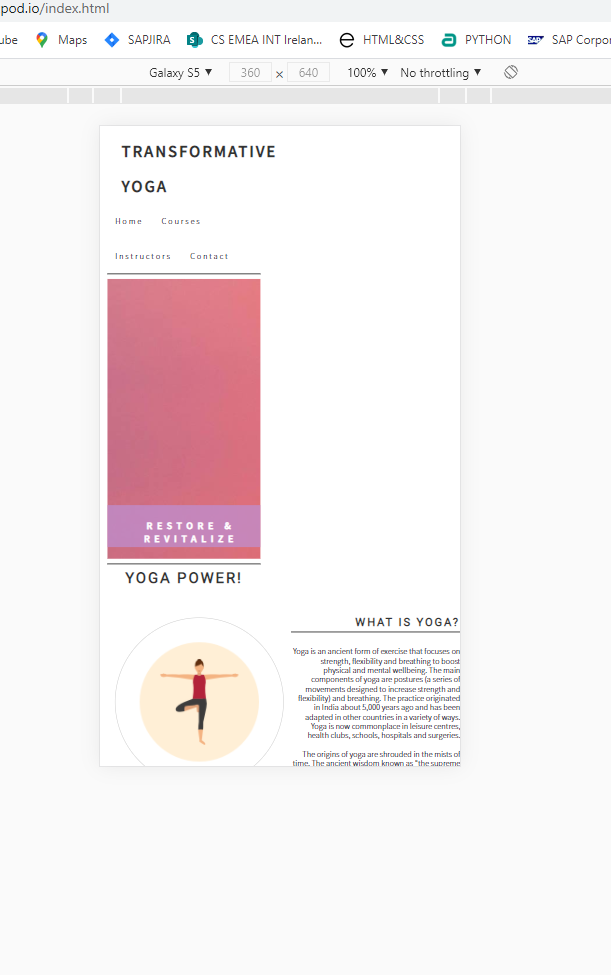

# Project-Name: Transformative Yoga - Angus Friel
This is my first milestone projetc and I chose to take on this project by builing a website for a yoga studio that offers online and studio-based yoga classes. I chose this topic as I have a friend that is a yoga instructor so obtain the content was very easy. I also used other sites and content ot help flesh it out.  

  
## Features

This website will have information regarding yoga classes, both online and in studio. It is for anyone who wants to know more about yoga and this business’ yoga classes. 

### Browser Icon

I replaced the oringal world icon with a "burn-alt" from fontawesome. This was done my using: [Gauger](https://gauger.io/fonticon/) to download the fontawesome icone and then embeded it into the header to create the burn icon on the browser tab. 

### Navigation Bar

The fully responsive navigation bar will have four pages, home(index.html), courses(courses.html), instructors(instructors.html) and contact(contact.html). The nav bar will be across all three pages. The user can also click on the logo in the top left of the page, Transformative Yoga, to navigate back to the landing page.
This will allow the user to easily navigate across the website.

## Website Pages
  
### The Landing Page

* This is the focus of the page. It will have a hero image with some text. I used keyframes here to show the image expanding towards the user. I only used keyframes on the landing page but had a static image for the rest of the pages on the website. Below the hero image there will be displayed the benefits of yoga and these benefits will be accompanied by yoga icons/images wrapped in a circle. 

* The value of this page is to discribe what yoga is and why it can benefit them. Originally, I had the page too clutered and then decided to strip it back with the bear essentials for the user. This is done by breaking it down in to those to very simple categories. What is Yoga, and, Why do Yoga. This in turn is to inspire the user about yoga and to go further into the site to see what is on offer for them.

_This was the first hero image and text I had but it was nonresponsive. I fixed this by changing my ID's and Classes tag to the correct ones in CSS, as I was mixing these up, and then tweaking and rearranging the text inside the hero image_

_This is the new hero image_

* _The first image and text the user see is, What is yoga. Here, it is explained very simply for the user._

* _The second image and text on the landing page is, Why do Yoga? Here the site lists the reason why the user will have a benefiacal experince when the participate in a yoga class, or several classes._

* _The footer will have links to facebook, instagram, and youtube, as well an email link to directly contact the studio. This will be across all pages._

### Courses Page

* This page will have the various classes a user can take part in. From introduction classes to yoga training classesand preganacy yoga for mother to be. 

* _The classes listed are of value to the user so they can see what will fit with there schedule. These clases will have accompying pictures with links to the contact page so a user can contact the studio about classes._

* _Below this secton of this page there will be two videos that a user can watch and get a feel for what the studio might offer during a class._

### Instructors Page
* I originally had this on the landing page, and it just looked too clutered. After some consideration and playing around I realised the site's structure and asthetics would suite better if the instructors had their own page. It consists of three instructors with their backgrounds in yoga as well the classes the teach and at what times. For the layout of this I had the instructor’s picture with their bio beside them and the class times underneath thier picture.

* The user will be able to see the various instructors and their styles and available times when they teach their classes. This will be very useful to the user when consider a style of yoga, a certain class, or just for interest in their future need if they wish to progress into training to become a yoga instructor themselves.

### Contact Page

* This page will consist of a form the user can fill in to take part in the classes or if they wish to just contact the studio if they have any quiries. It will have a drop-down menu with different queries that the user can ask in relation to the topic they wish to discuss. This will aid the user to reach out to the studio to beign their yoga journey. 

* Also, next to this will be a google-map of where the studio is located so the user can find the studio easily. Although it states that because of Covid-19 that it is currently closed.

## Technologies used

This project consists of pure HTML5 and CSS.

## Testing

During testing of the site, I ran into some problems while testing the site out on a smaller screen. On a wide screen the site worked fine but the hero text on the hero image would not respond to resizing. Below is the wide screen image.

* _Here is the image when I tried media quries:_

* _Here is the image when I tried to reduce it:_

* _I figured out that it was the CSS I had in place:_

* _Once I removed that I had a responsive bit of text to work with:_

### Non-Responsive Screens
I found from moving from screen to screen that none of my elements would comply with media queries. I could not figure out why for some time. Then I realised I was mixing up classes and ID's. Once I figured this out the site became more responive. 

*_Here my divs would not align_

*_and again_

*_This problem persisted across all my pages_

*_I had a fully functionaly site on a big screen but grid/flex and media queries where not working for me_

*_Now I have a functioning site thanks to my realisation._ 

I also had to change the pictures on the instructor page as one of them was stretched. The rest did not fit right with the new picture. So, I source images that where all the same size and used them instead. 

## Bugs

### Grid-box 
My grid box was non-responsive, and all jumbled up on the screen. It took a while to figure it out but i realised i had multiple grids on the screen. Once I realised this and condensed the grids into one grid the issue was resolved. 

### Overlapping DIVS

I had a problem with overlapping divs when the screen was reduced for mobile use. Thankfully, I discovered unicorn revealer which helped me to identify the problem. It was the padding and the height. I removed the padding altogether and set the height to auto. This helped to resolve the issue. 

### Social Icons on Footer

For the life of me i could not firgure out why these icons would not algin in a row and not a coloumn. It turns out i was over complicating the issue. I added them to a list and tried to arrange that into Display, inline but nothing was work. After a quick gogle on my issue I then realised the i-tag is an inline tag anyway, like <iframe> so once i reverted them back without a list the problem was resolved. 

### HTML

I had a few problems with random unclosed div’s, and other tags not being closed, as well as ID's being used twice. All of this was found once I ran my code through W3 Validator and all errors were then corrected. 

### CSS

I had one missing curly bracket from my CSS that was spotted once I ran it through the validator.

## Deployment

    

## Where I got my idea and content for a yoga website

[Instagram](https://www.instagram.com/radicaltransformationyoga/)

[Facebook](https://www.facebook.com/Radicaltransformationyoga)

[Yoga Room](https://yoga.ie/)

[Yoga Journal](https://www.yogajournal.com/lifestyle/health/womens-health/count-yoga-38-ways-yoga-keeps-fit/)
[Yoga Journal](https://www.yogajournal.com/lifestyle/yoga-trends/21-under-40/)

## Videos I used for the courses page.

[YouTube Video 1](https://www.youtube.com/watch?v=8T39OBNaNzU)

[YouTube Video 2](https://www.youtube.com/watch?v=4C-gxOE0j7s)

